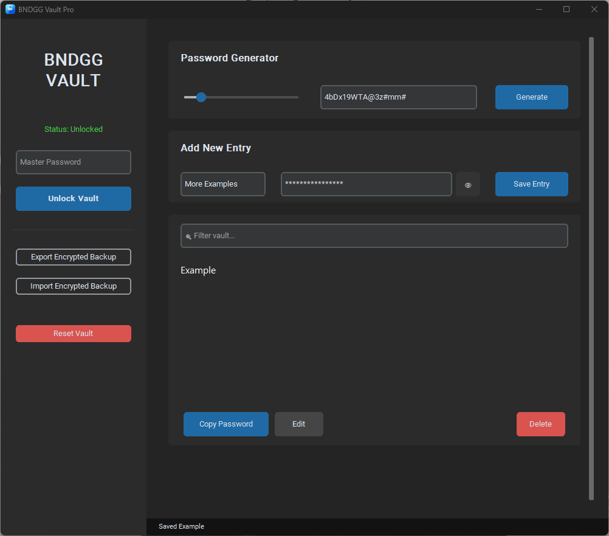

# BNDGG Vault 🛡️

A modern, secure, and portable password manager built with Python.



## Features

- **Strong Encryption:** AES-128 (Fernet) encryption with Argon2id key derivation (memory-hard, GPU/ASIC resistant).
- **Modern UI:** Built with CustomTkinter for a sleek, responsive dark-mode interface.
- **Zero Knowledge:** Your master password is never stored anywhere — only you can unlock your vault.
- **Encrypted Backups:** Export and import fully encrypted vault backups (salt + encrypted data in a single JSON file).
- **Auto-Lock:** Automatically locks the vault after 10 minutes of inactivity.
- **Smart Generator:** Integrated password generator with adjustable length (8–64 characters).
- **Auto-Security:** Automatically clears your clipboard 30 seconds after copying a password.
- **Show/Hide Toggle:** Instantly reveal or mask passwords with the 👁 button.

## Installation

### Option 1: Download the pre-built executable (Windows)
1. Go to the [Releases](../../releases) page.
2. Download `BNDGG-Vault.exe`.
3. Run it. No installation required.

> ⚠️ **Windows SmartScreen warning:** Because this app is not code-signed, Windows may show a "Windows protected your PC" warning on first run. Click **More info** → **Run anyway**. This is a false positive.

### Option 2: Run from source
```bash
git clone https://github.com/Krahzin/BNDGG-Vault.git
cd BNDGG-Vault
pip install -r requirements.txt
python password_manager.py
